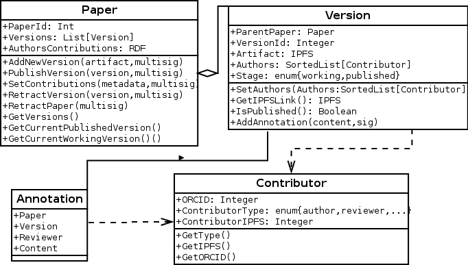

# SmartPapers

SmartPapers is a smart-contract approach to co-authoring and publishing scientific papers using Ethereum blockchain for tracking living research objects and agreements between authors in a decentralised and trusted way.

 
